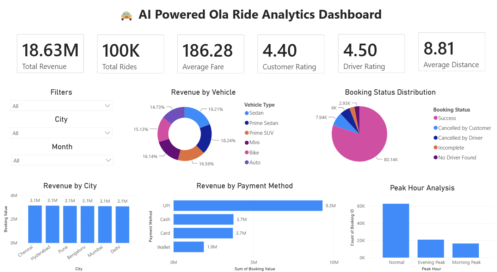
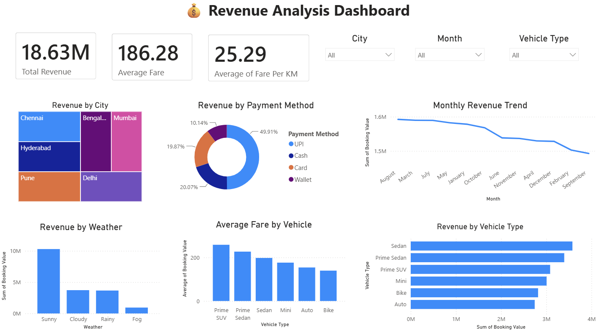
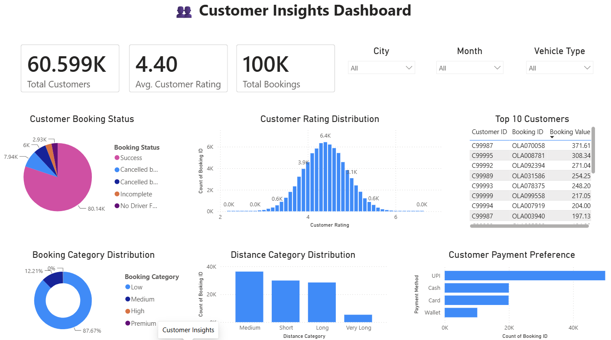
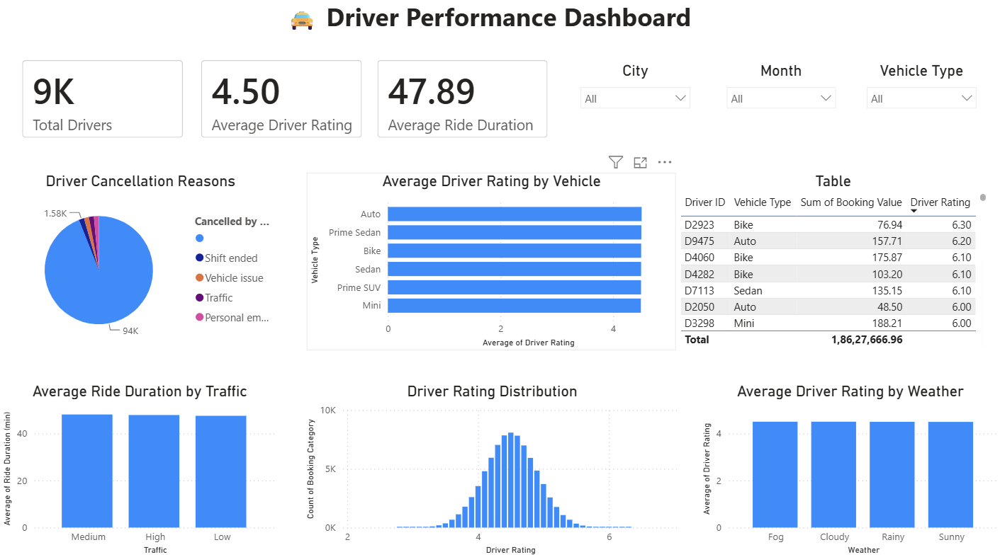
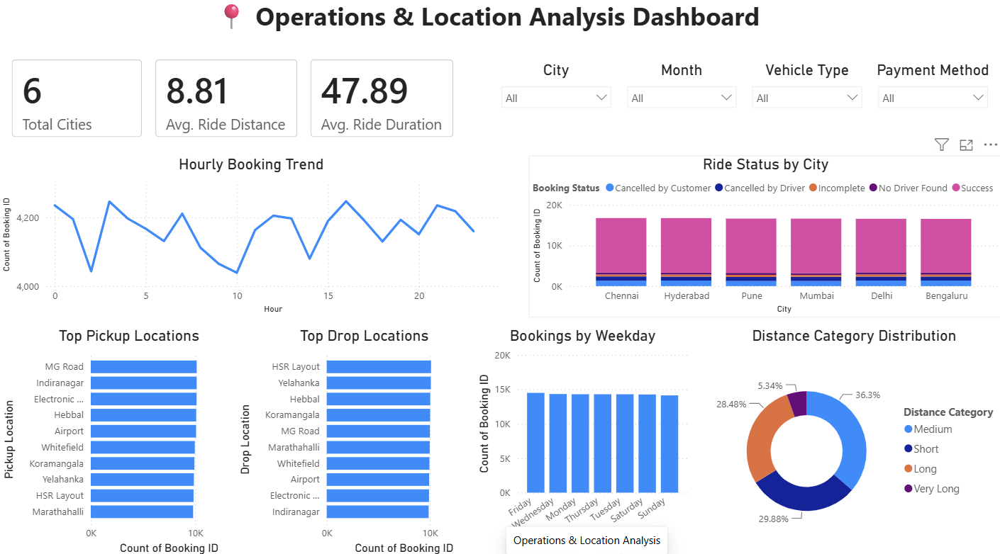

<div align="center">

# 🚖 AI Powered Ola Ride Analytics

### End-to-End Data Analytics Project using Python, SQL, MySQL & Power BI


---

### 📊 Transforming Raw Ride Data into Actionable Business Insights

An end-to-end Data Analytics project that demonstrates the complete analytics lifecycle—from raw data preprocessing to business intelligence dashboards using **Python, SQL, MySQL, Pandas, NumPy, and Power BI**.

</div>

---

# 📑 Table of Contents

- [📌 Project Overview](#-project-overview)
- [🎯 Business Problem](#-business-problem)
- [🎯 Project Objectives](#-project-objectives)
- [📊 Executive Summary](#-executive-summary)
- [📂 Dataset Information](#-dataset-information)
- [🛠 Technology Stack](#-technology-stack)
- [📁 Project Structure](#-project-structure)
- [⚙ Project Workflow](#-project-workflow)
- [🧹 Data Cleaning](#-data-cleaning)
- [📈 Exploratory Data Analysis](#-exploratory-data-analysis)
- [🗄 SQL Business Analysis](#-sql-business-analysis)
- [📊 Power BI Dashboard](#-power-bi-dashboard)
- [📷 Dashboard Gallery](#-dashboard-gallery)
- [💡 Key Business Insights](#-key-business-insights)
- [📌 Business Recommendations](#-business-recommendations)
- [🚀 Installation](#-installation)
- [📈 Future Enhancements](#-future-enhancements)
- [👨‍💻 Author](#-author)

---

# 📌 Project Overview

Ride-hailing platforms generate millions of ride records every day. These datasets contain valuable information that can help businesses understand customer behavior, optimize driver performance, improve operational efficiency, and maximize revenue.

This project demonstrates how raw ride-booking data can be transformed into meaningful business insights using modern data analytics tools.

The complete workflow includes:

- ✅ Data Collection
- ✅ Data Cleaning
- ✅ Feature Engineering
- ✅ Exploratory Data Analysis (EDA)
- ✅ SQL Business Analysis
- ✅ ETL Pipeline
- ✅ Interactive Power BI Dashboard
- ✅ Business Insight Generation

---

# 🎯 Business Problem

Ride-sharing companies must answer critical business questions to remain competitive:

- Which city contributes the highest revenue?
- Which vehicle category is the most profitable?
- Which payment method is preferred by customers?
- How do customer and driver ratings impact operations?
- What are the busiest booking hours?
- Which booking statuses affect overall revenue?
- How can operational efficiency be improved using data?

This project addresses these questions through structured analytics and dashboard reporting.

---

# 🎯 Project Objectives

The main objectives of this project are:

- Clean and preprocess a large ride-booking dataset.
- Perform comprehensive exploratory data analysis.
- Design and execute SQL queries for business reporting.
- Build an interactive Power BI dashboard.
- Generate actionable business insights.
- Demonstrate an end-to-end analytics workflow suitable for real-world business scenarios.

---

# 📊 Executive Summary

This project analyzes approximately **100,000 Ola ride records** to uncover operational trends, customer preferences, revenue patterns, and service performance.

The analysis combines:

- Python for data preprocessing and analysis
- SQL for business reporting
- Power BI for interactive dashboards
- Pandas and NumPy for data manipulation

The final solution provides decision-makers with insights into revenue generation, booking patterns, driver performance, customer satisfaction, and operational efficiency.

---

# 📂 Dataset Information

The dataset used in this project contains approximately **100,000 Ola ride booking records** collected for analytical purposes. It represents a real-world ride-hailing scenario and includes information about bookings, customers, drivers, revenue, ride status, payment methods, ratings, and operational factors.

### 📌 Dataset Features

| Feature | Description |
|----------|-------------|
| Booking ID | Unique ride booking identifier |
| Customer ID | Unique customer identifier |
| Driver ID | Unique driver identifier |
| Booking Status | Ride status (Success, Cancelled, etc.) |
| Booking Value | Total fare collected |
| Vehicle Type | Mini, Prime Sedan, Auto, Bike, SUV, etc. |
| Payment Method | Cash, UPI, Card, Wallet |
| Ride Distance | Distance travelled during ride |
| Ride Duration | Total ride duration |
| Customer Rating | Rating provided by customer |
| Driver Rating | Driver performance rating |
| City | Ride location |
| Booking Date | Date of booking |
| Booking Time | Time of booking |

### 📊 Dataset Summary

| Metric | Value |
|---------|------:|
| Total Records | 100,000+ |
| Dataset Type | Structured CSV |
| Rows | ~100K |
| Columns | 15+ |
| File Format | CSV |
| Database | MySQL |

---

# 🛠 Technology Stack

| Category | Tools Used |
|----------|------------|
| Programming Language | Python |
| Data Processing | Pandas, NumPy |
| Database | MySQL |
| SQL IDE | MySQL Workbench |
| Data Visualization | Power BI |
| Notebook | Jupyter Notebook |
| Version Control | Git |
| Repository Hosting | GitHub |
| IDE | VS Code |

---

# 📁 Project Structure

```text
AI-Ola-Ride-Analytics
│
├── data
│   ├── raw
│   ├── processed
│   └── cleaned
│
├── notebooks
│   ├── 01_Data_Loading.ipynb
│   ├── 02_Data_Cleaning.ipynb
│   ├── 03_Exploratory_Data_Analysis.ipynb
│   ├── 04_ETL_To_MySQL.ipynb
│   └── 05_SQL_Business_Analysis.ipynb
│
├── sql
│   ├── create_database.sql
│   ├── create_tables.sql
│   └── 40_business_queries.sql
│
├── powerbi
│   └── Ola_Ride_Analytics.pbix
│
├── reports
│
├── screenshots
│
├── README.md
├── requirements.txt
└── LICENSE
```

---

# ⚙️ End-to-End Project Workflow

```text
               Raw Dataset
                    │
                    ▼
          Data Loading (Python)
                    │
                    ▼
          Data Cleaning & Validation
                    │
                    ▼
       Feature Engineering & Processing
                    │
                    ▼
     Exploratory Data Analysis (EDA)
                    │
                    ▼
            ETL to MySQL Database
                    │
                    ▼
         SQL Business Analysis (40+ Queries)
                    │
                    ▼
      Interactive Power BI Dashboard
                    │
                    ▼
      Business Insights & Recommendations
```

---

# 🔄 Analytics Pipeline

This project follows a complete analytics pipeline used in real-world business intelligence projects.

### Step 1 — Data Collection
- Imported raw ride booking dataset.
- Verified dataset structure.
- Checked data types and missing values.

### Step 2 — Data Cleaning
- Removed duplicate records.
- Handled missing values.
- Corrected inconsistent data.
- Converted columns into appropriate data types.

### Step 3 — Exploratory Data Analysis
- Revenue Analysis
- Booking Analysis
- Customer Behaviour
- Driver Performance
- Payment Trends
- Ride Distribution
- Rating Analysis

### Step 4 — ETL Pipeline
- Cleaned dataset exported from Python.
- Loaded processed data into MySQL.
- Verified successful data import.

### Step 5 — SQL Business Analysis
- Executed 40+ SQL business queries.
- Generated KPIs.
- Identified revenue trends.
- Compared city performance.
- Analyzed booking behaviour.

### Step 6 — Power BI Dashboard
- Executive Dashboard
- Revenue Dashboard
- Customer Dashboard
- Driver Dashboard
- Operations Dashboard

### Step 7 — Business Insights
- Identified high-performing cities.
- Compared vehicle categories.
- Evaluated customer satisfaction.
- Analyzed operational efficiency.
- Generated data-driven recommendations.

---

# 🏗 Project Architecture

```text
                 CSV Dataset
                      │
                      ▼
          Python (Pandas & NumPy)
                      │
                      ▼
             Data Cleaning & EDA
                      │
                      ▼
               MySQL Database
                      │
                      ▼
              SQL Business Queries
                      │
                      ▼
              Power BI Dashboard
                      │
                      ▼
              Business Insights
```
---

# 🧹 Data Cleaning

High-quality analytics begins with clean and reliable data. Before performing any analysis, the dataset was carefully preprocessed using **Python (Pandas)**.

### Data Cleaning Steps

✔ Removed duplicate records

✔ Handled missing values

✔ Standardized categorical values

✔ Converted data types

✔ Removed inconsistent entries

✔ Created new analytical features

✔ Verified data quality

✔ Exported cleaned dataset

---

## 📋 Data Quality Report

| Metric | Status |
|---------|--------|
| Missing Values | ✅ Handled |
| Duplicate Records | ✅ Removed |
| Invalid Entries | ✅ Corrected |
| Data Types | ✅ Standardized |
| Null Values | ✅ Cleaned |
| Final Dataset | ✅ Ready for Analysis |

---

# 🔧 Feature Engineering

To improve analysis and dashboard capabilities, additional analytical features were created.

### Engineered Features

- Revenue Category
- Peak Hour
- Distance Category
- Ride Duration Category
- Payment Group
- Vehicle Category
- Booking Success Flag
- Cancellation Flag

These features improve business reporting and dashboard interactivity.

---

# 📈 Exploratory Data Analysis (EDA)

Comprehensive Exploratory Data Analysis was performed to understand booking trends, customer behavior, revenue distribution, and operational performance.

---

## 📊 Revenue Analysis

The revenue analysis focused on identifying:

- Highest revenue generating cities
- Revenue contribution by vehicle type
- Average booking value
- Revenue distribution
- Monthly revenue trend

---

## 🚖 Ride Analysis

Ride analysis included:

- Ride distance distribution
- Ride duration analysis
- Booking trends
- Vehicle demand
- Successful vs cancelled rides

---

## 👥 Customer Analysis

Customer analysis focused on:

- Customer ratings
- Booking frequency
- Preferred payment methods
- Ride preferences
- Cancellation behavior

---

## 🚗 Driver Analysis

Driver performance was evaluated using:

- Driver ratings
- Completed rides
- Cancellation percentage
- Average trip value
- Operational efficiency

---

## 💳 Payment Analysis

Payment analysis included:

- Cash Transactions
- UPI Payments
- Credit/Debit Cards
- Digital Wallet Usage

This helped identify customer payment preferences.

---

## 🌆 City Analysis

City-wise analysis was performed to determine:

- Total Revenue
- Total Bookings
- Average Fare
- Customer Ratings
- Driver Ratings

---

# 📊 Exploratory Data Analysis Highlights

The project includes visualizations such as:

- Revenue Distribution
- Booking Status Analysis
- Vehicle-wise Booking Analysis
- Customer Rating Distribution
- Driver Rating Distribution
- Payment Method Analysis
- Ride Distance Histogram
- City-wise Revenue
- Booking Trend
- Correlation Heatmap

---

# 🗄 SQL Business Analysis

The cleaned dataset was imported into **MySQL** for business reporting.

More than **40 SQL queries** were written to answer real-world business questions.

---

## SQL Categories

### Revenue Analysis

- Total Revenue
- Revenue by City
- Revenue by Vehicle Type
- Revenue by Payment Method
- Revenue by Booking Status

---

### Customer Analysis

- Average Customer Rating
- Customer Booking Count
- Customer Payment Preferences
- Customer Cancellation Analysis

---

### Driver Analysis

- Driver Ratings
- Driver Performance
- Successful Trips
- Driver-wise Revenue

---

### Booking Analysis

- Total Bookings
- Booking Success Rate
- Booking Status
- Cancellation Reasons

---

### Ride Analysis

- Average Ride Distance
- Average Ride Duration
- Longest Ride
- Shortest Ride

---

### Business KPIs

- Total Revenue
- Total Bookings
- Average Booking Value
- Customer Satisfaction
- Driver Satisfaction
- Revenue Growth
- Ride Success Rate

---

# 📌 Key Performance Indicators (KPIs)

| KPI | Description |
|------|-------------|
| Total Revenue | Overall revenue generated |
| Total Bookings | Total completed bookings |
| Average Fare | Average booking value |
| Booking Success Rate | Successful ride percentage |
| Customer Rating | Overall customer satisfaction |
| Driver Rating | Overall driver performance |
| Vehicle Performance | Revenue contribution by vehicle |
| City Performance | Revenue contribution by city |

---

# 📈 Business Metrics Tracked

✔ Revenue

✔ Bookings

✔ Booking Success Rate

✔ Customer Satisfaction

✔ Driver Satisfaction

✔ Ride Distance

✔ Ride Duration

✔ Cancellation Rate

✔ Revenue by Vehicle

✔ Revenue by City

✔ Revenue by Payment Method

✔ Peak Hour Demand

---

# 📊 SQL Deliverables

The SQL analysis produced:

- 40+ Business Queries
- Revenue Reports
- Customer Reports
- Driver Reports
- Booking Reports
- Performance Reports
- KPI Reports
- Operational Reports

These reports were further visualized using Power BI dashboards.

---

# 📊 Power BI Dashboard

The final stage of the project was the development of a comprehensive **interactive Power BI Dashboard** that transforms raw analytical findings into actionable business intelligence.

The dashboard is designed for managers and business stakeholders to monitor operational performance, customer behaviour, driver efficiency, and revenue trends through interactive visualizations.

---

# 📷 Dashboard Gallery

## 🏠 Executive Dashboard



### Dashboard Highlights

- Total Revenue
- Total Bookings
- Average Ride Value
- Booking Success Rate
- Customer Rating
- Driver Rating
- Revenue Trend
- Booking Distribution

---

## 💰 Revenue Analytics Dashboard



### Key Visualizations

- Revenue by City
- Revenue by Vehicle Type
- Revenue by Payment Method
- Monthly Revenue Trend
- Revenue Distribution
- Average Booking Value

---

## 👥 Customer Analytics Dashboard



### Key Insights

- Customer Ratings
- Customer Satisfaction
- Booking Behaviour
- Preferred Payment Methods
- Booking Frequency
- Customer Distribution

---

## 🚖 Driver Analytics Dashboard



### Driver Performance Metrics

- Driver Ratings
- Ride Completion Rate
- Driver Revenue
- Average Trips
- Cancellation Analysis
- Performance Comparison

---

## ⚙ Operations Dashboard



### Operational Insights

- Peak Booking Hours
- Ride Distance Analysis
- Ride Duration Analysis
- Booking Status
- Traffic Impact
- Operational KPIs

---

# 📈 Dashboard Features

The Power BI solution provides:

✔ Interactive Filters

✔ Dynamic KPIs

✔ Drill-down Analysis

✔ Cross Filtering

✔ Trend Analysis

✔ Comparative Analysis

✔ Interactive Charts

✔ Business KPI Monitoring

✔ Real-time Dashboard Experience

---

# 📊 Dashboard KPIs

| KPI | Description |
|------|-------------|
| 💰 Total Revenue | Total earnings generated from bookings |
| 🚖 Total Bookings | Overall completed ride bookings |
| ⭐ Customer Rating | Average customer satisfaction score |
| ⭐ Driver Rating | Average driver performance rating |
| 📍 Top City | Highest revenue generating city |
| 🚗 Best Vehicle | Vehicle category contributing highest revenue |
| 💳 Preferred Payment | Most frequently used payment method |
| 📈 Booking Success Rate | Percentage of successful bookings |

---

# 💡 Key Business Insights

The analytics revealed several important business findings.

### 📍 Revenue Insights

- Major metropolitan cities contributed the highest revenue.
- Premium vehicle categories generated higher average booking values.
- Revenue distribution remained balanced across key operational regions.

---

### 🚖 Booking Insights

- Successful bookings accounted for the majority of rides.
- Peak booking demand occurred during office commute hours.
- Weekend demand showed noticeable growth in several cities.

---

### 👥 Customer Insights

- Customer ratings remained consistently high.
- Digital payment methods were preferred over cash.
- Customer satisfaction was positively correlated with successful ride completion.

---

### 🚗 Driver Insights

- Driver ratings remained consistently above average.
- High-performing drivers completed significantly more rides.
- Driver performance directly influenced customer satisfaction.

---

### 💳 Payment Insights

- UPI emerged as the most preferred payment method.
- Digital payment adoption exceeded traditional cash transactions.
- Online payments contributed significantly to overall booking value.

---

### ⚙ Operational Insights

- Peak-hour demand created operational bottlenecks.
- Booking cancellations increased during heavy traffic conditions.
- Efficient driver allocation improved ride completion rates.

---

# 📌 Business Recommendations

Based on the analysis, the following recommendations can improve operational performance:

### Revenue

- Expand premium vehicle availability in high-demand cities.
- Introduce dynamic pricing during peak hours.
- Improve revenue tracking through city-wise performance monitoring.

---

### Customer Experience

- Launch customer loyalty and rewards programs.
- Improve ride allocation speed.
- Reduce cancellations through better driver matching.

---

### Driver Performance

- Reward highly rated drivers with incentive programs.
- Provide additional training for lower-rated drivers.
- Monitor driver performance using dashboard KPIs.

---

### Operations

- Optimize driver allocation during peak hours.
- Improve route planning using traffic analysis.
- Increase vehicle availability in high-demand regions.

---

# 📈 Business Impact

This analytics solution enables organizations to:

- Improve operational efficiency
- Increase customer satisfaction
- Enhance driver performance
- Optimize revenue generation
- Support data-driven decision making
- Identify growth opportunities
- Monitor business KPIs in real time

---

# 🚀 Installation Guide

Follow these steps to run the project on your local machine.

## 1️⃣ Clone the Repository

```bash
git clone https://github.com/suryansh700/AI-Ola-Ride-Analytics.git
```

---

## 2️⃣ Navigate to Project Directory

```bash
cd AI-Ola-Ride-Analytics
```

---

## 3️⃣ Install Required Libraries

```bash
pip install -r requirements.txt
```

---

## 4️⃣ Open Jupyter Notebook

```bash
jupyter notebook
```

Open the notebooks in sequence:

- 01_Data_Loading.ipynb
- 02_Data_Cleaning.ipynb
- 03_Exploratory_Data_Analysis.ipynb
- 04_ETL_To_MySQL.ipynb
- 05_SQL_Business_Analysis.ipynb

---

## 5️⃣ Open Power BI Dashboard

Open:

```
powerbi/Ola_Ride_Analytics.pbix
```

using Microsoft Power BI Desktop.

---

# 📦 Project Deliverables

This repository includes:

✅ Raw Dataset

✅ Cleaned Dataset

✅ Data Cleaning Notebook

✅ Exploratory Data Analysis Notebook

✅ ETL Pipeline

✅ SQL Scripts

✅ 40+ Business SQL Queries

✅ Interactive Power BI Dashboard

✅ Business Reports

✅ Dashboard Screenshots

✅ Documentation

---

# 🎯 Skills Demonstrated

This project demonstrates practical experience in:

### Programming

- Python
- SQL

### Data Analysis

- Data Cleaning
- Data Wrangling
- Exploratory Data Analysis
- Feature Engineering
- Data Validation

### Databases

- MySQL
- SQL Query Optimization
- Business Reporting

### Visualization

- Power BI
- Dashboard Design
- KPI Development
- Interactive Reporting

### Professional Skills

- Business Intelligence
- Data Storytelling
- Analytical Thinking
- Problem Solving
- Data-Driven Decision Making

---

# 📈 Business Value

The developed analytics solution enables organizations to:

✔ Monitor operational performance

✔ Improve customer satisfaction

✔ Optimize driver allocation

✔ Increase revenue

✔ Reduce booking cancellations

✔ Support strategic business decisions

✔ Improve operational efficiency

✔ Track KPIs using interactive dashboards

---

# 🔮 Future Enhancements

Future improvements for this project include:

- AI-powered demand forecasting
- Ride fare prediction using Machine Learning
- Customer segmentation
- Driver performance prediction
- Real-time dashboard integration
- Cloud deployment
- Interactive web dashboard
- Automated report generation

---

# 📚 Learning Outcomes

During this project, I gained practical experience in:

- End-to-End Data Analytics
- Data Cleaning
- Data Transformation
- Exploratory Data Analysis
- SQL Business Queries
- Power BI Dashboard Development
- Business Intelligence Reporting
- Git & GitHub Version Control

---

# 📌 Repository Highlights

| Category | Details |
|----------|---------|
| Project Type | End-to-End Data Analytics |
| Domain | Ride Sharing Analytics |
| Dataset Size | 100,000+ Records |
| Programming Language | Python |
| Database | MySQL |
| Dashboard Tool | Power BI |
| SQL Queries | 40+ |
| Analysis Type | Business Intelligence |
| Documentation | Included |

---

# 🤝 Contributing

Contributions are welcome!

If you'd like to improve this project:

1. Fork the repository.
2. Create a new feature branch.
3. Commit your changes.
4. Push the branch.
5. Open a Pull Request.

---

# 📄 License

This project is licensed under the **MIT License**.

Feel free to use this project for educational and learning purposes.

---

# 👨‍💻 Author

## Suryansh Singh

**B.Tech Information Technology Student**

### Connect with me

- **GitHub:** https://github.com/suryansh700
- **LinkedIn:** www.linkedin.com/in/suryansh-singh-028a202b9
- **Email:** singhsuryansh2389@gmail.com

---

# 🙏 Acknowledgements

Special thanks to:

- Python Community
- Pandas Documentation
- NumPy Documentation
- MySQL Community
- Microsoft Power BI
- GitHub
- Open-source Data Analytics Community

---

# ⭐ Support

If you found this project useful:

⭐ Star this repository

🍴 Fork the repository

📢 Share it with others

---

<div align="center">

## 🚖 Thank You for Visiting!

### If you like this project, don't forget to ⭐ Star the Repository.

**Happy Learning! 🚀**

</div>
